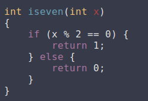
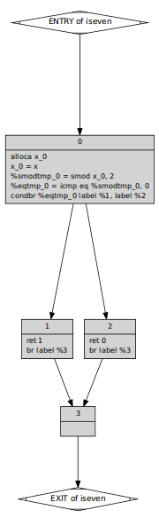
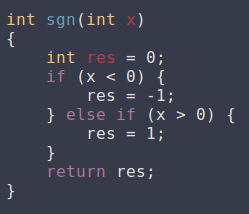
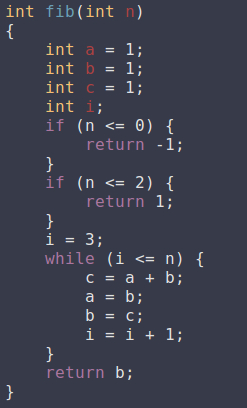
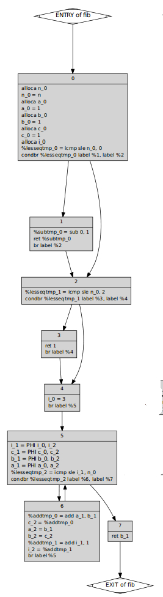

# CSC
`CSC` is a simple and easy extensible C Subset Compiler. It's not realy for production, it was made JUST FOR FUN.
It contains lexer, parser, llvm-ir-codegenerator and SSA-form-builder.

### Tech

`CSC` uses a number of open source projects to work properly:

* [LLVM](https://llvm.org/) - Framework for building compilers and codegenerators.

And of course `CSC` itself is open source with a [public repository][dill]
 on GitHub.

### Installation

`CSC` requires [LLVM](https://llvm.org/) v5.0+ to run.

Install the dependencies and build compiler.

```sh
$ sudo apt-get install llvm
$ sudo apt-get install clang
$ git clone https://github.com/masyagin1998/CSC.git
$ cd CSC
$ make all  # to make compiler
$ make test # to check compiler's work
```

### What can it do?

`CSC` supports simplified version of `C89` with:
 - `int` variables definitions;
 - `while` loops;
 - `if-then` and `if-then-else` statements;
 - inner `if` and `while` statements (multiple inner statements)
 - all arithmetical and logical operations;
 - and many other;
 
### Lexer

Linear Object-Oriented lexer with error recovery and comments ignoring.

### Parser

Recursive top-down parser (I know it is shitty, but OK for small projects) for simplified to `LL(1)` C grammar, which turns lexemas to Abstract Syntax Tree (`AST`). AST can be debugged to file using in human-readable format.

### Codegenerator

Codegenerator to `LLVM IR BitCode` from abstract syntax tree. Yon can link generated object files (`*.o` files) with `main.c` 

### SSA-builder

Classical code-generation algorithm, which firstly creates Control Flow Graph (`CFG`) from `AST`, and then creates `SSA`-form using Dominance Frontier Algorithm (`DFA`).

### Examples

- Check is number is even

  |       Code                     |                SSA              |
  |--------------------------------|---------------------------------|
  |  |  |

- Get sign of number

  |       Code                     |                SSA              |
  |--------------------------------|---------------------------------|
  |  |  |

- Fibonacci

  |       Code                     |                SSA              |
  |--------------------------------|---------------------------------|
  |  |  |

### Many thanks to:
Anatoly Sinyavin - BMSTU Optimal Code Generation teacher
